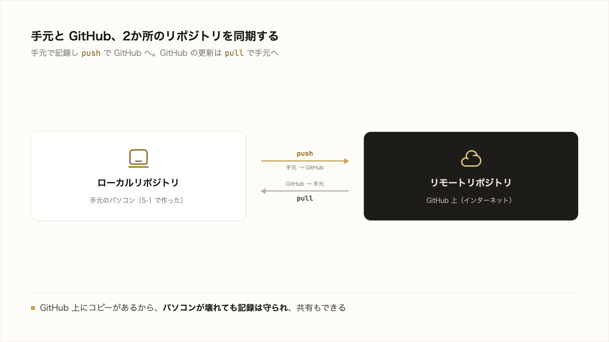

# 5-2-1 GitHub とは何か

この Chapter では、手元の Git をインターネット上の GitHub につなぎ、成果物を保全・共有・公開し、チームで協働するところまでを扱います。まず GitHub とは何かを押さえ、アカウントと認証を用意してから、実際に成果物を上げて公開します。

| セクション | テーマ | 種類 |
|---|---|---|
| 5-2-1 | GitHub とは何か | 概念 |
| 5-2-2 | GitHub をセットアップする | ハンズオン |
| 5-2-3 | 成果物をリポジトリに上げる | 混合 |
| 5-2-4 | コミット・push・プルリクエスト | 概念 |
| 5-2-5 | コミットしてはいけないものと .gitignore | 概念 |
| 5-2-6 | レビューと取り込み・協働 | 概念 |
| 5-2-7 | GitHub Pages で公開する | 混合 |

**この Chapter の進め方**: 5-2-1 で GitHub の全体像をつかみ、5-2-2 でアカウントと認証を用意します。5-2-3 で手元の成果物を GitHub に上げ（ここで手を動かします）、5-2-4〜5-2-6 でコミット・push・プルリクエスト・秘密情報の扱い・レビューと協働を概念として整理します。最後に 5-2-7 で成果物を Web サイトとして公開します（ここでも手を動かします）。git の操作の多くは Claude Code が代行するので、手を動かすのはセットアップ・push・公開に絞られます。

!!! note "前提知識"
    このセクションは 5-1-3「ブランチとマージ」の内容を前提としています。

<video controls preload="metadata" playsinline width="100%">
  <source src="https://github.com/coachtech-material/pj_X/releases/download/videos/5-2-1.mp4" type="video/mp4">
</video>

## このセクションで学ぶこと

- Git と GitHub が別物であること（手元の版管理ツールと、それを載せる Web プラットフォーム）
- 手元のローカルリポジトリと、GitHub 上のリモートリポジトリの関係
- GitHub が提供する主要機能の全体像（この Chapter で一つずつ扱う）

GitHub とは何かを、Git との違いと提供機能の全体像から押さえます。

---

## 導入: 手元の Git だけでは、共有も公開もできない

Chapter 5-1 で、手元に Git が動く状態を作り、変更を記録できるようになりました。ただ、その記録はすべて自分のパソコンの中だけにあります。

このままでは、パソコンが壊れれば記録ごと失われます。他の人に渡して一緒に直すこともできませんし、世に公開して読んでもらうこともできません。手元の Git の記録を、インターネット上の安全な場所に置き、共有・公開・協働の土台にする。それを担うのが GitHub です。

---

## Git と GitHub は別もの

5-1-1 でも触れたとおり、Git と GitHub は別物です。混同されがちなので、ここで改めて整理します。

- **Git** は、手元（自分のパソコン）で動く**バージョン管理ツール**です。変更を記録し、履歴をたどり、過去に戻る、といった版管理そのものを担います。
- **GitHub** は、その Git のリポジトリを**インターネット上にホスト（保管）する Web プラットフォーム**です。GitHub 公式ドキュメント（[GitHub と Git について](https://docs.github.com/ja/get-started/start-your-journey/about-github-and-git)）は、GitHub を「コードを保存、共有、他の人との共同作業ができるクラウドベースのプラットフォーム」と説明しています。

つまり、版管理の仕組みそのものが Git、それをネット上に置いて保全・共有・公開・協働を載せる場所が GitHub です。GitHub は Git の上に成り立っており、GitHub を使うときも、手元では 5-1 で学んだ Git がそのまま動いています。

## ローカルリポジトリとリモートリポジトリ

GitHub を使うと、リポジトリが2か所に存在することになります。

- **ローカルリポジトリ**: 手元のパソコンにある、5-1 で作ったリポジトリ。
- **リモートリポジトリ**: GitHub 上にある、同じリポジトリの控え。

この2つは、同期して使います。手元で記録した変更（コミット）を GitHub 上へ送ることを **push**、GitHub 上の変更を手元へ取り込むことを **pull** と呼びます。

ふだんは手元のローカルリポジトリで作業し、節目で push して GitHub に反映します。GitHub 上にコピーがあることで、パソコンが壊れても記録は守られ、他の人はリモートリポジトリを通じてあなたの成果物を見たり、一緒に作業したりできます。push と pull の実際の操作も、Claude Code に代行させられます。

## GitHub が載せる主要機能

GitHub は、リポジトリのホスティングに加えて、共同作業のための機能を一通り備えています。この Chapter で扱う主要機能を、ひととおり見渡しておきます。

| 機能 | 何ができるか | 扱うセクション |
|---|---|---|
| リモートによる保全・共有 | 成果物を GitHub 上に上げて守り、他の人に見せる | 5-2-3 |
| コミット・push・プルリクエスト | 変更を記録して送り、取り込みを提案する | 5-2-4 |
| 秘密情報の管理 | 公開してはいけないものをコミットから除外する | 5-2-5 |
| プルリクエストのレビュー・Issues | 変更を確認し合い、課題を管理して協働する | 5-2-6 |
| GitHub Pages（公開）・Actions（自動化） | 成果物を Web サイトとして公開し、push を契機に自動で反映する | 5-2-7 |

いまはそれぞれの名前と役割を「こういうことができる」と把握すれば十分です。この Chapter を通して、一つずつ実際に使ったり、概念として押さえたりしていきます。

!!! info "ポイント"
    GitHub には数多くの機能がありますが、非エンジニアがまず押さえるべきは「成果物を安全に保全・共有し、必要なら公開し、変更を確認し合って協働する」という基本の部分です。本研修ではこの基本に絞り、各機能を Claude Code と組み合わせて使えるようにします。

---

## まとめ

- Git は手元で動くバージョン管理ツール、GitHub はその Git リポジトリをインターネット上にホストして保全・共有・公開・協働を載せる Web プラットフォーム。両者は別物
- GitHub を使うと、手元のローカルリポジトリと GitHub 上のリモートリポジトリの2か所にリポジトリができる。push でローカル→リモート、pull でリモート→ローカルに同期する
- GitHub の主要機能は、保全・共有（5-2-3）／コミット・push・プルリクエスト（5-2-4）／秘密情報の管理（5-2-5）／レビュー・協働（5-2-6）／公開・自動化（5-2-7）。この Chapter で一つずつ扱う

---

次のセクションでは、GitHub を使い始める準備をします。GitHub のアカウントを作成し、手元の Git から GitHub へ安全に push できるよう、GitHub CLI を使って認証を済ませて、成果物を上げる準備が整った状態を作ります。
