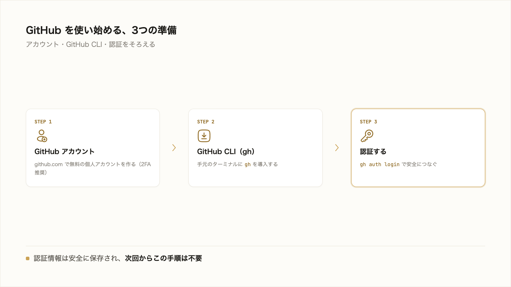

# 5-2-2 GitHub をセットアップする

!!! note "前提知識"
    このセクションは 5-2-1「GitHub とは何か」と 5-1-1「バージョン管理と Git」の内容を前提としています。

!!! note "このハンズオンで使うもの"
    - **Git**（5-1-1 で導入済み）: 手元の版管理ツール。push の主体
    - **GitHub アカウント**: このセクションで作成する
    - **GitHub CLI（`gh`）**: このセクションで導入する、GitHub を扱うコマンド。認証を最も平易にする道具

## このセクションで学ぶこと

- GitHub のアカウントを作成する手順
- 手元の Git から GitHub へ安全に push できるよう、GitHub CLI（`gh`）で認証する手順
- パスワードをそのまま使う認証が廃止され、トークンや CLI による認証が標準であること

GitHub を使い始める準備として、アカウントを作り、手元から GitHub へ安全につなぐ認証を済ませます。

---

## 導入: GitHub に上げる前に、準備を整える

5-1 で、手元に Git が動く状態を作りました。これを GitHub につなぐには、2つの準備が要ります。1つは GitHub の**アカウント**、もう1つは、手元のパソコンから GitHub へ安全に接続するための**認証**です。

認証が必要なのは、誰でもあなたのリポジトリに書き込めては困るからです。かつてはユーザー名とパスワードで接続できましたが、安全性の理由からパスワードをそのまま使う方式は廃止されました（GitHub 公式ドキュメント[GitHub への認証について](https://docs.github.com/ja/authentication/keeping-your-account-and-data-secure/about-authentication-to-github)、2026年6月時点）。いまは、トークンや鍵を使う、より安全な方法が標準です。その中で非エンジニアに最も平易なのが、これから使う GitHub CLI（`gh`）です。ブラウザ経由で認証でき、git の push に必要な認証も `gh` が肩代わりしてくれます。



---

## セットアップ前の確認

始める前に、次がそろっているか確認します。

- [ ] 5-1-1 で Git が使える状態になっている（`git --version` でバージョンが表示される）
- [ ] ふだん受信できるメールアドレスがある（GitHub の登録と確認メールに使う）

---

## 実践: GitHub アカウントと認証を用意する

### Step 1: GitHub アカウントを作る

ブラウザで [github.com](https://github.com/) を開き、**サインアップ（Sign up）** に進みます。画面の案内に従って、メールアドレス・パスワード・ユーザー名を入力します。途中で確認コードがメールに届くので、入力して登録を完了します。無料の個人アカウントで、本研修の内容はすべて行えます。

登録後、2要素認証（2FA）の設定をうながされることがあります。アカウントを守るため、設定を強く推奨します（公式手順は GitHub 公式ドキュメント[GitHub でのアカウントの作成](https://docs.github.com/ja/get-started/start-your-journey/creating-an-account-on-github)を参照）。

!!! tip "ヒント"
    GitHub に登録するメールアドレスは、5-1-1 で `git config --global user.email` に設定したものとそろえておくと、あなたのコミットが GitHub 上で自分のアカウントに正しく結びつきます。違っていても動きますが、そろえておくと分かりやすくなります。

### Step 2: GitHub CLI（`gh`）を導入する

VS Code の統合ターミナル（開き方は 1-2-2）に、GitHub を操作するコマンド `gh` を導入します。お使いの OS に合わせて進めてください（2026年6月時点。最新の手順は公式サイト [cli.github.com](https://cli.github.com/) で確認できます）。

=== "macOS"
    パッケージ管理ツール Homebrew を使っている場合は、次のコマンドを実行します。

    ```bash
    brew install gh
    ```

    Homebrew が無い、または分からない場合は、公式サイト（cli.github.com）から macOS 用のインストーラをダウンロードして実行します。

=== "Windows"
    次のコマンドを実行します（`winget` は Windows 10／11 に標準で備わっています）。

    ```powershell
    winget install --id GitHub.cli
    ```

    `winget` が使えない場合は、公式サイト（cli.github.com）から Windows 用のインストーラをダウンロードして実行します。

導入できたら、ターミナルを開き直して、次のコマンドでバージョンを確認します。

```bash
gh --version
```

`gh version 2.x.x`（2026年6月時点では 2.83 前後）のように表示されれば成功です。

### Step 3: `gh auth login` で認証する

次のコマンドを実行して、GitHub への認証を始めます。

```bash
gh auth login
```

対話形式で、いくつか質問されます。おおむね次の順に、矢印キーで選んで Enter を押します（表示される文言は版によって変わります。2026年6月時点）。

- ログインする先: **GitHub.com** を選ぶ
- Git 操作で使うプロトコル: **HTTPS** を選ぶ
- GitHub の認証情報で Git も認証するか: **Yes** を選ぶ
- 認証方法: **Login with a web browser**（ブラウザでログイン）を選ぶ

最後の選択をすると、画面に8桁ほどのワンタイムコード（例: `ABCD-1234`）が表示されます。これを覚えて（コピーして）から Enter を押すと、ブラウザが開きます。ブラウザでそのコードを入力し、GitHub にログインして、表示される許可（認可）に同意します。ターミナルに `Logged in as （あなたのユーザー名）` のような表示が出れば、認証は完了です。認証情報は安全に保存されるので、次回からこの手順は不要です。

!!! warning "注意"
    認証がうまく進まないときは、いったん `gh auth status` で現在の状態を確認できます。途中で失敗した場合は、もう一度 `gh auth login` を実行してやり直してください。どの選択肢を選ぶか迷ったら、上のとおり「GitHub.com → HTTPS → Yes → ブラウザでログイン」を選べば、本研修ではそのまま進められます。

### Step 4: 認証できたか確認する

最後に、認証の状態を確認します。

```bash
gh auth status
```

`Logged in to github.com account （あなたのユーザー名）` のように表示されれば、手元の Git から GitHub へ安全に接続できる状態が整っています。

---

## 完成チェックリスト

- [ ] GitHub のアカウントを作成し、ブラウザでログインできる
- [ ] `gh --version` で GitHub CLI のバージョンが表示される
- [ ] `gh auth status` で「Logged in to github.com」と表示される

---

## まとめ

- GitHub を使うには、アカウントと、手元から安全につなぐ認証の2つが要る。アカウントは無料の個人用で十分で、2要素認証の設定が推奨される
- パスワードをそのまま使う認証は廃止された。非エンジニアに最も平易なのは GitHub CLI（`gh`）による認証で、git の push 認証も `gh` が肩代わりする
- `gh auth login` を実行し、「GitHub.com → HTTPS → Yes → ブラウザでログイン」を選んでワンタイムコードで認証する。`gh auth status` で状態を確認できる

---

次のセクションでは、いよいよ手元の成果物を GitHub に上げます。GitHub 上に新しいリモートリポジトリを作り、これまで作ってきた成果物を Git のリポジトリにして、公開してはいけないものを .gitignore で除外したうえで、初回のコミットと push を Claude Code に代行させ、GitHub の画面に自分の成果物が表示されるところまで進めます。
