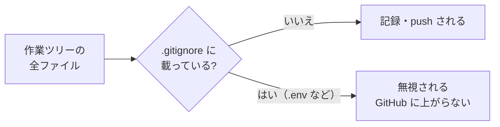

# 5-2-5 コミットしてはいけないものと .gitignore

!!! note "前提知識"
    このセクションは 5-2-3「成果物をリポジトリに上げる」と 2-5-3「セキュリティ」の内容を前提としています。

## このセクションで学ぶこと

- コミットして公開してはいけないものがあること（APIキー・パスワード・個人情報。2-5-3 と結びつけて）
- .gitignore で、それらを追跡対象から除外する考え方と書き方
- 誤って含めないための確認のしかた

GitHub に上げてはいけないものを見極め、.gitignore で確実に除外する考え方を押さえます。

!!! note "補足"
    このセクションの .gitignore の例やコマンドは、理解のための例です。秘密の値を環境変数やシークレットとして実際に設定して扱うのは、アプリ開発の Part6 です。

---

## 導入: 一度 push したものは、消しても残る

Git は、変更をすべて履歴として記録します。これは普段は心強い性質ですが、秘密情報をうっかりコミットしたときには逆に働きます。一度コミットして push してしまったものは、あとからファイルを削除しても、過去の履歴の中に残り続けます。公開リポジトリなら、その間に誰かに見られたかもしれません。

つまり、秘密情報は「上げてしまってから消す」のでは間に合いません。**最初から入れない**ことが肝心です。そのための仕組みが .gitignore です。

---

## コミットしてはいけないもの

GitHub に上げてはいけないものは、2-5-3 で学んだ「AI に渡してはいけないもの」とほぼ重なります。

- **認証情報**: APIキー、パスワード、アクセストークンなど。2-5-3 で「渡してはいけない代表」として扱ったものです
- **個人情報**: 顧客の名前・連絡先など、本人の同意なく外に出してはいけない情報
- **社外秘の情報**: 未公開の社内資料、機密の事業情報

これらが公開リポジトリに入ると、深刻な被害につながります。APIキーが漏れれば第三者に使われて課金が発生し、個人情報が漏れれば信用を失います。2-5-3 の「AI に渡してよいもの／いけないもの」の線引きが、そのまま「GitHub に上げてよいもの／いけないもの」の線引きになります。

!!! info "ポイント"
    4-4-3 では、Claude Code の設定（settings.json の deny）で `.env` などを「AI に読ませない」ようにしました。これは AI から守る仕組みです。.gitignore は「git に記録・公開させない」仕組みで、守る対象が違います。秘密情報は、この2つの層で重ねて守ります。

## .gitignore で追跡から外す

.gitignore は、リポジトリの直下に置く、Git に「無視するファイル」を伝えるファイルです。GitHub 公式ドキュメント（[ファイルを無視する](https://docs.github.com/ja/get-started/getting-started-with-git/ignoring-files)）は、これを「コミットの際に無視するファイルとディレクトリを Git に指示」するものと説明しています。ここに書いたものは、記録・push の対象から外れます。

書き方は単純で、1行に1つ、無視したいものを書きます。

```text
# 認証情報・秘密の値（# で始まる行はコメント）
.env
.env.local
*.key

# 個人情報を含むデータ
customers.csv

# パソコン固有・自動生成される不要物
.DS_Store
node_modules/
```

ファイル名そのまま（`.env`）、拡張子をまとめて（`*.key` は .key で終わるすべて）、フォルダごと（`node_modules/`）といった指定ができます。秘密の値は、慣習として `.env` というファイルにまとめ、`.env` を .gitignore で除外する、という形がよく使われます（この実践は Part6 で行います）。

.gitignore は、変更を記録・push しようとするときに「これは無視する」とふるい分けるフィルタのように働きます。



!!! warning "注意"
    **すでにコミットしてしまったファイルは、.gitignore に書くだけでは無視されません**。Git は一度追跡を始めたファイルを追い続けるためです。その場合は、先に追跡を解除してから無視ルールを足します。

    ```bash
    git rm --cached secret.env
    ```

    `git rm --cached` は、ファイル自体は手元に残したまま、Git の追跡だけを外します。ただし過去の履歴には残っているので、すでに push 済みの秘密情報は、キーを無効化して作り直すなどの対処が別途必要です。だからこそ、5-2-3 のように **push する前に .gitignore を置く** ことが大切です。

## 誤って含めないための確認

人の目だけでは、秘密情報の混入を見落とすことがあります。push する前に、Claude Code に確認を頼むのが確実です。

```text
これから GitHub に push する前に、秘密情報（APIキー・パスワード・個人情報など）が
含まれていないか、.gitignore が適切かを確認して
```

Claude Code はファイルを点検し、危なそうなものがあれば指摘してくれます（機密情報の扱いは [Claude Code のセキュリティ](https://code.claude.com/docs/ja/security) も参照）。秘密の値は、そもそもコードやファイルに直接書かず、環境変数として本体から分けて持つのが定石です。この「環境変数・シークレットで秘密を分離する」やり方は、2-4-5 で概念に触れ、Part6 のアプリ開発で実際に扱います。

---

## まとめ

- 一度コミット・push した秘密情報は、後で消しても履歴に残る。だから最初から入れないことが肝心
- 上げてはいけないものは、2-5-3 の「AI に渡してはいけないもの」と同じ（認証情報・個人情報・社外秘）。これが GitHub の線引きにもなる
- .gitignore に1行1パターンで書くと、記録・push の対象から外れる。すでに追跡済みのファイルは `git rm --cached` で先に追跡を外す必要がある
- push 前に Claude Code に混入チェックを頼める。秘密の値は環境変数として分離するのが定石で、実践は Part6 で扱う

---

次のセクションでは、複数人で協働する仕組みを扱います。プルリクエストでのレビューと取り込み（マージ）、他の人の変更を手元に取り込む pull、Issues での課題管理を押さえ、Claude Code が出した変更を人がレビューして取り込む協働の形を理解します。
