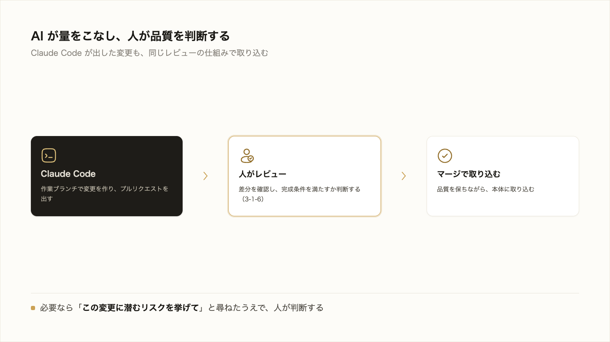
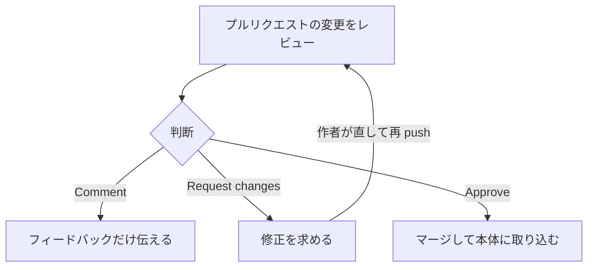
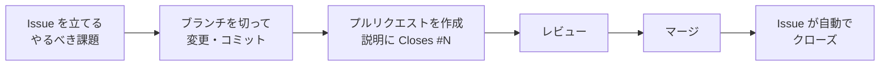

# 5-2-6 レビューと取り込み・協働

!!! note "前提知識"
    このセクションは 5-2-4「コミット・push・プルリクエスト」の内容を前提としています。

<video controls preload="metadata" playsinline width="100%">
  <source src="https://github.com/coachtech-material/pj_X/releases/download/videos/5-2-6.mp4" type="video/mp4">
</video>

## このセクションで学ぶこと

- プルリクエストのレビュー（変更を確認し、コメント・承認・変更要求する）
- マージと取り込み（変更を本体に取り込み、他の人の変更を手元に取り込む）
- Issues で課題を管理する仕組み（担当者・ラベル・プルリクエストとの連携と自動クローズ）
- Issue から始めて、ブランチ・プルリクエスト・レビュー・マージまでを一周させる流れ

複数人で進めるときの、確認し合い・取り込み・課題管理の仕組みを押さえ、最後に自分の成果物で一周を体験します。

!!! note "補足"
    本文に出てくるレビューや Issues の操作は、仕組みを理解するための例です。実務ではチームでの協働や Part6 の開発で使います。ただし、このセクションは末尾に「やってみよう」を置きました。一人でも、自分の成果物に対して、Issue から始まる協働の一周を実際に試せます。

---

## 導入: 一人なら要らない。チームだと要る

一人で作業しているなら、変更をコミットして自分でマージすれば完結します。しかし複数人で進めると、それぞれが勝手に本体を変えてしまっては、内容がぶつかり、品質も保てません。

そこで GitHub には、お互いの変更を確認し合い、課題を分担して進めるための仕組みが備わっています。変更を取り込む前に確かめる**レビュー**、変更を取り込む**マージと取り込み**、やるべきことを管理する **Issues** です。



---

## プルリクエストのレビュー

5-2-4 で、プルリクエストは「変更をレビューし議論する場」だと押さえました。そのレビューでは、変更を取り込む前に、内容を確認してフィードバックを返します。GitHub 公式ドキュメント（[プルリクエストのレビューについて](https://docs.github.com/ja/pull-requests/collaborating-with-pull-requests/reviewing-changes-in-pull-requests/about-pull-request-reviews)）によれば、レビュー担当者はマージ前に「変更にコメントしたり、改善点を提案したり、変更を承認または要求したりする」ことができます。

レビューの結果は、次の3つの状態で伝えます。

- **Comment**: 承認も要求もせず、フィードバックだけを伝える
- **Approve**: マージしてよいと承認する
- **Request changes**: 修正が必要な点を指摘する

変更の差分の特定の行に直接コメントを付けたり（インラインコメント）、修正案をその場で提案したりできます。やり取りが済んだスレッドは解決済みにできます。こうして、変更が本体に入る前に、内容の良し悪しを確かめられます。



Request changes が付いたら、作者が修正して再び push し、もう一度レビューを受けます。Approve されると、マージへ進めます。

## マージと取り込み

レビューを経て問題がなければ、プルリクエストを**マージ**して、変更を本体（base ブランチ。ふつう main）に取り込みます。これで提案された変更が正式にリポジトリの一部になります。役目を終えた作業ブランチは削除できます。

逆に、他の人がマージした変更を、自分の手元（ローカルリポジトリ）に取り込むこともあります。これが **pull** です。5-2-1 で push の逆として触れたとおり、リモートの最新を手元に反映します。チームで作業するときは、自分が手を加える前に pull して最新の状態にそろえておく、というのが基本のリズムになります。pull も Claude Code に代行させられます。

```text
リモートの最新の変更を、手元に取り込んで
```

なお、まだ手元に無いリポジトリ（他の人のものや、自分が別のパソコンで作ったもの）を、まるごと自分のパソコンに複製することを **clone**（クローン）と呼びます。GitHub 上のリポジトリを取ってきて作業を始めるときの、最初の一歩です。手元（自分のパソコン）と GitHub のやり取りは、push（リモートへ送る）・pull（リモートから取り込む）・clone（リモートを丸ごと複製する）の3つで、おおむねカバーできます。

## Issues で課題を管理する

複数人で進めるとき、「何をやるべきか」を共有して分担する場が **Issues** です。GitHub 公式ドキュメント（[Issues について](https://docs.github.com/ja/issues/tracking-your-work-with-issues/about-issues)）は、Issues を使って「作業の計画、議論、追跡」ができると説明しています。直すべきバグ、足したい機能、検討したいアイデアなど、書き留めてチームで話し合いたいものを、1件ずつ課題として管理します。

1つの Issue は、1つの課題を表します。次の要素で内容を整理します。

- **タイトルと説明**: 何を・なぜやるかを書く。説明の中に `- [ ]` でやることのチェックリスト（タスクリスト）も書ける
- **担当者（Assignee）**: 誰がその課題に取り組むかを割り当て、責任の所在をはっきりさせる
- **ラベル（Label）**: `bug`（バグ）・`enhancement`（改善）などの分類を付け、種類で絞り込めるようにする
- **マイルストーン（Milestone）**: 複数の Issue を「次のリリースまで」のような区切りでまとめる
- **コメント**: その課題について議論する

文章の中で `@` に続けてユーザー名を書けば特定のメンバーに通知でき（メンション）、`#` に続けて番号を書けば他の Issue やプルリクエストを参照できます。

Issue には、開いている **Open** と、片付いた **Closed** の2つの状態があります。課題が解決したら Issue をクローズします。ここでプルリクエストとの連携が効きます。プルリクエストの説明文に `Closes #12` のように書いておくと（`Closes`・`Fixes`・`Resolves` などのキーワードに Issue 番号を続ける）、そのプルリクエストが本体（main）にマージされた瞬間に、対応する Issue が**自動でクローズ**されます（GitHub 公式ドキュメント[プルリクエストを Issue にリンクする](https://docs.github.com/ja/issues/tracking-your-work-with-issues/linking-a-pull-request-to-an-issue)）。課題を立て、変更で解決し、マージで閉じる、という一連がひとつながりになります。



こうして、チーム全体で「いま何が進んでいて、誰が何を担当しているか」を見渡しながら、課題を一つずつ片付けていけます。

## Claude Code の変更を人がレビューして取り込む

ここまでの協働の仕組みは、Claude Code との組み合わせでそのまま生きます。本研修で繰り返してきた「AI が変更を作り、人が確かめてから採用する」という進め方を、GitHub 上で回せるからです。

具体的には、Claude Code に作業ブランチで変更を作らせてプルリクエストを出させ（5-2-4）、人がそのプルリクエストの差分をレビューして、完成条件を満たしていれば（3-1-6）マージで取り込みます。AI が変更の量をこなし、人が品質を判断して取り込む、という分担です。これは、やり方を仕組みとして共有し属人化を解消する（Part4）流れとも重なります。チームの誰が出した変更でも、Claude Code が出した変更でも、同じレビューの仕組みで品質を保ちながら取り込めます。

Issues も Claude Code と相性よく使えます。Claude Code は、GitHub CLI（`gh`）を通じて、Issue を立てる・一覧する・中身を読む、といった操作を代行できます。さらに、Issue を「やるべきことの指示書」として渡し、「この Issue を解決して」と頼めば、Claude Code が Issue の内容を読んで、作業ブランチを切り、変更し、プルリクエストまで出す、という流れも任せられます。あなたは、課題を Issue として言葉にし、出てきたプルリクエストをレビューして取り込む役に回れます。次の「やってみよう」で、この一連を実際に通します。

!!! info "ポイント"
    Claude Code が生成した変更も、人のレビューを通してから取り込むのが安全です。差分を確認し、必要なら Claude Code 自身に「この変更に潜むリスクを挙げて」と尋ねたうえで、マージするかを人が判断します。

---

## やってみよう: Issue から始める改善を一周させる

ここまで見てきた協働の仕組みを、自分の成果物（入門書 `my-book`）に対して、一度通して体験します。Issue を立て、Claude Code に直させ、プルリクエストでレビューして取り込み、Issue が閉じるまでの一周です。チームでの協働を、一人で再現する形になります。実務では Claude Code が多くを代行しますが、一度自分で通すと、ブランチ・プルリクエスト・レビュー・マージ・Issue がどうつながっているかが腹に落ちます。

始める前に、次がそろっているか確認します。

- [ ] 成果物（`my-book`）が GitHub に上がっている（5-2-3）
- [ ] Claude Code が `gh` で GitHub に認証済み（5-2-2）

**1. 改善したい点を Issue として立てる**

ブラウザで `my-book` のリポジトリを開き、上部の **Issues** タブをクリックして、**New issue** を押します。タイトルと説明に、本に加えたい小さな改善を書いて、**Submit new issue** をクリックします。

- タイトルの例: 「はじめにに対象読者を明記する」
- 説明の例: 「この本が誰に向けたものかが分かるよう、はじめにの章に対象読者を一段落加える」

立てた Issue には番号が付きます（最初の1件なら `#1`。以降この番号を使うので、あなたの番号に読み替えてください）。

**2. Claude Code に Issue を渡して、ブランチで対応させる**

`my-book` のフォルダで Claude Code を起動し、Issue 番号を渡して依頼します。

```text
GitHub の Issue #1 を解決して。
新しい作業ブランチを切って、そのブランチの中で対応して、push してプルリクエストを出して。
プルリクエストの説明には Closes #1 を入れて。
```

Claude Code は、`gh` で Issue #1 の内容を読み、作業ブランチを切り、本文を直し、コミットして push し、プルリクエストを作成します。説明に `Closes #1` が入ります。変更を加える操作には承認を求められるので、内容を確認しながら許可します。生成される変更の中身は一例で、あなたのものとは異なってかまいません。大事なのは、作業ブランチが切られ、Issue に紐づいたプルリクエストが作られることです。

**3. プルリクエストの差分をレビューする**

ブラウザで `my-book` のリポジトリの **Pull requests** タブを開き、いま作られたプルリクエストを開きます。**Files changed** で差分を確認し、Issue の狙い（対象読者が伝わるか）を満たしているかを、完成条件と照らして確かめます。

- 直したい点があれば、Claude Code に「ここをこう直して」と伝えると、同じブランチに修正が push され、プルリクエストの差分が更新されます
- 問題なければ、次に進みます

**4. マージして、Issue が閉じるのを確認する**

プルリクエストのページで **Merge pull request** → **Confirm merge** を押します。マージすると、次が起こります。

- 変更が本体（main）に取り込まれる
- 説明に `Closes #1` があるので、Issue #1 が**自動でクローズ**される（**Issues** タブで Closed になっているのを確認できます）
- 役目を終えた作業ブランチは、画面に出る **Delete branch** で削除できます

このマージや確認も、Claude Code に「このプルリクエストをマージして、作業ブランチを消して」と頼めます。

**5. 手元を最新の main にそろえる**

マージで GitHub 上の main が一歩進んだので、手元のローカルリポジトリも最新にそろえます。

```text
リモートの最新の変更を、手元に取り込んで
```

Claude Code が pull を代行します。これで手元の main も、改善が入った最新の状態になります。

!!! success "確認"
    Issue が Closed になり、改善が main に入り、作業ブランチが消えていれば、Issue → ブランチ → プルリクエスト → レビュー → マージ → クローズ の一周ができたことになります。これは、チームで誰かの変更を取り込むときも、Claude Code が出した変更を取り込むときも、同じ流れです。

    このやってみようで入れた改善は、自分の本を良くするものなので、元に戻す必要はありません（作業ブランチは手順4で削除済みです）。ここで改善した `my-book` を、次のセクションでそのまま Web サイトとして公開します。

---

## まとめ

- プルリクエストのレビューでは、マージ前に変更を確認し、Comment・Approve・Request changes の3つの状態でフィードバックを返す。特定の行へのインラインコメントもできる
- レビューを経てマージすると、変更が本体に取り込まれる。他の人の変更を手元に取り込むのが pull で、作業前に pull して最新にそろえる
- Issues は、やるべき課題（バグ・改善・アイデア）を共有・分担する場。担当者・ラベル・コメントで整理し、プルリクエストの説明に `Closes #N` と書くと、マージで対応する Issue が自動でクローズされる
- Issue → ブランチ → プルリクエスト → レビュー → マージ → クローズ の一周は、Claude Code が出した変更を人が確かめて取り込む協働そのもの。AI が量をこなし、人が品質を判断する

---

次のセクションでは、Chapter の締めくくりとして、GitHub に上げた成果物を Web サイトとして公開します。Claude Code に読みやすい静的サイト（HTML/CSS）へ変換させ、公開ソース（ブランチ・フォルダ）と入口ファイルを構成して GitHub Pages で公開し、公開 URL で表示されるところまで進めます。push を契機に GitHub が自動で公開する様子から、変更が自動で反映される仕組みも押さえます。
