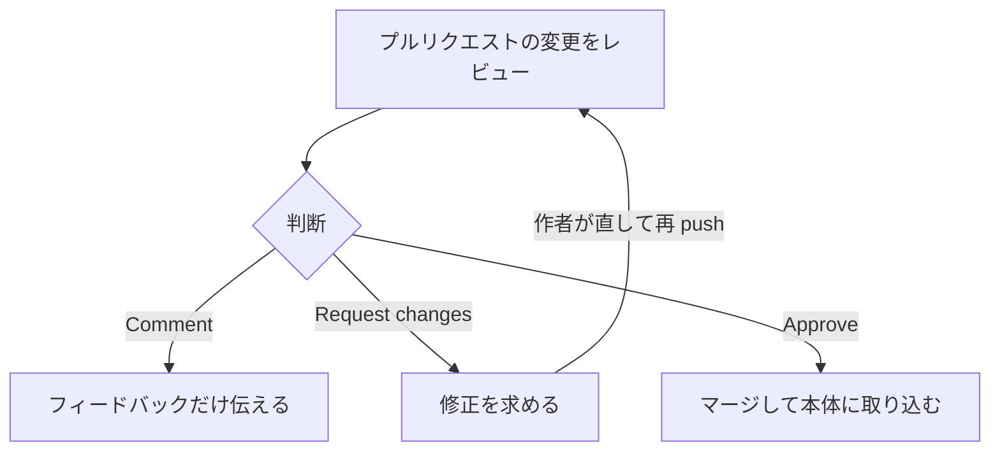

# 5-2-6 レビューと取り込み・協働

!!! note "前提知識"
    このセクションは 5-2-4「コミット・push・プルリクエスト」の内容を前提としています。

## このセクションで学ぶこと

- プルリクエストのレビュー（変更を確認し、コメント・承認・変更要求する）
- マージと取り込み（変更を本体に取り込み、他の人の変更を手元に取り込む）
- Issues で課題を管理し、複数人で協働する基本

複数人で進めるときの、確認し合い・取り込み・課題管理の仕組みを押さえます。

!!! note "補足"
    このセクションのレビューや Issues の操作は、仕組みを理解するための例です。実際にこれらを使うのは、チームでの協働や Part6 の開発です。一人で進めている間は、こういう協働ができると知っておけば十分です。

---

## 導入: 一人なら要らない。チームだと要る

一人で作業しているなら、変更をコミットして自分でマージすれば完結します。しかし複数人で進めると、それぞれが勝手に本体を変えてしまっては、内容がぶつかり、品質も保てません。

そこで GitHub には、お互いの変更を確認し合い、課題を分担して進めるための仕組みが備わっています。変更を取り込む前に確かめる**レビュー**、変更を取り込む**マージと取り込み**、やるべきことを管理する **Issues** です。

---

## プルリクエストのレビュー

5-2-4 で、プルリクエストは「変更をレビューし議論する場」だと押さえました。そのレビューでは、変更を取り込む前に、内容を確認してフィードバックを返します。GitHub 公式ドキュメント（[プルリクエストのレビューについて](https://docs.github.com/ja/pull-requests/collaborating-with-pull-requests/reviewing-changes-in-pull-requests/about-pull-request-reviews)）によれば、レビュー担当者はマージ前に「変更にコメントしたり、改善点を提案したり、変更を承認または要求したりする」ことができます。

レビューの結果は、次の3つの状態で伝えます。

- **Comment**: 承認も要求もせず、フィードバックだけを伝える
- **Approve**: マージしてよいと承認する
- **Request changes**: 修正が必要な点を指摘する

変更の差分の特定の行に直接コメントを付けたり（インラインコメント）、修正案をその場で提案したりできます。やり取りが済んだスレッドは解決済みにできます。こうして、変更が本体に入る前に、内容の良し悪しを確かめられます。



Request changes が付いたら、作者が修正して再び push し、もう一度レビューを受けます。Approve されると、マージへ進めます。

## マージと取り込み

レビューを経て問題がなければ、プルリクエストを**マージ**して、変更を本体（base ブランチ。ふつう main）に取り込みます。これで提案された変更が正式にリポジトリの一部になります。役目を終えた作業ブランチは削除できます。

逆に、他の人がマージした変更を、自分の手元（ローカルリポジトリ）に取り込むこともあります。これが **pull** です。5-2-1 で push の逆として触れたとおり、リモートの最新を手元に反映します。チームで作業するときは、自分が手を加える前に pull して最新の状態にそろえておく、というのが基本のリズムになります。pull も Claude Code に代行させられます。

```text
リモートの最新の変更を、手元に取り込んで
```

なお、まだ手元に無いリポジトリ（他の人のものや、自分が別のパソコンで作ったもの）を、まるごと手元に複製することを **clone**（クローン）と呼びます。GitHub 上のリポジトリを手元に持ってきて作業を始めるときの最初の一歩です。手元と GitHub のやり取りは、push（手元からリモートへ送る）・pull（リモートの更新を手元へ取り込む）・clone（リモートを丸ごと複製する）の3つで、おおむねカバーできます。

## Issues で課題を管理する

複数人で進めるとき、「何をやるべきか」を共有して分担する場が **Issues** です。GitHub 公式ドキュメント（[Issues について](https://docs.github.com/ja/issues/tracking-your-work-with-issues/about-issues)）は、Issues を使って「作業の計画、議論、追跡」ができると説明しています。

1つの Issue は、1つの課題（やるべきタスク、直すべきバグ、検討したいアイデアなど）を表します。タイトルと説明で内容を書き、担当者を割り当て、ラベルで分類し、コメントで議論できます。プルリクエストと紐付けて、その変更がどの課題に対応するかを示すこともできます。`@`に続けて名前を書けば特定のメンバーに知らせ、`#`に続けて番号を書けば他の Issue を参照できます。こうして、チーム全体で「いま何が進んでいて、誰が何を担当しているか」を見渡せます。

## Claude Code の変更を人がレビューして取り込む

ここまでの協働の仕組みは、Claude Code との組み合わせでそのまま生きます。本研修で繰り返してきた「AI が変更を作り、人が確かめてから採用する」という進め方を、GitHub 上で回せるからです。

具体的には、Claude Code に作業ブランチで変更を作らせてプルリクエストを出させ（5-2-4）、人がそのプルリクエストの差分をレビューして、完成条件を満たしていれば（3-1-6）マージで取り込みます。AI が変更の量をこなし、人が品質を判断して取り込む、という分担です。これは、やり方を仕組みとして共有し属人化を解消する（Part4）流れとも重なります。チームの誰が出した変更でも、Claude Code が出した変更でも、同じレビューの仕組みで品質を保ちながら取り込めます。

!!! info "ポイント"
    Claude Code が生成した変更も、人のレビューを通してから取り込むのが安全です。差分を確認し、必要なら Claude Code 自身に「この変更に潜むリスクを挙げて」と尋ねたうえで、マージするかを人が判断します。

---

## まとめ

- プルリクエストのレビューでは、マージ前に変更を確認し、Comment・Approve・Request changes の3つの状態でフィードバックを返す。特定の行へのインラインコメントもできる
- レビューを経てマージすると、変更が本体に取り込まれる。他の人の変更を手元に取り込むのが pull で、作業前に pull して最新にそろえる
- Issues は、やるべき課題（タスク・バグ・アイデア）を共有・分担する場。担当者・ラベル・コメント・PR との紐付けで、チームの進捗を見渡せる
- Claude Code が出した変更も、プルリクエストのレビューを通して人が確かめてから取り込む。AI が量をこなし、人が品質を判断する協働になる

---

次のセクションでは、Chapter の締めくくりとして、GitHub に上げた成果物を Web サイトとして公開します。Claude Code に読みやすい静的サイト（HTML/CSS）へ変換させ、公開ソース（ブランチ・フォルダ）と入口ファイルを構成して GitHub Pages で公開し、公開 URL で表示されるところまで進めます。push を契機に GitHub が自動で公開する様子から、変更が自動で反映される仕組みも押さえます。
