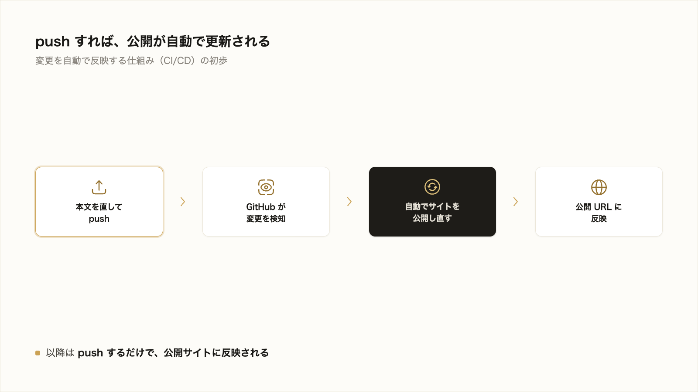

# 5-2-7 GitHub Pages で公開する

!!! note "前提知識"
    このセクションは 5-2-3「成果物をリポジトリに上げる」の内容を前提としています。

## このセクションで学ぶこと

- GitHub Pages とは何か（リポジトリのファイルから静的サイトを公開するサービス）
- 成果物を Claude Code に静的サイト（HTML/CSS）へ変換させ、GitHub Pages で公開する流れ
- push を契機に公開が自動で更新される仕組み（CI/CD の初歩）

GitHub に上げた成果物を、公開 URL で誰でも読める Web サイトとして公開します。

---

## 導入: 仕上げて終わりにせず、読まれる状態に置く

5-2-3 で、これまで育ててきた成果物を GitHub に上げました。ただ、いまの状態では、リポジトリにアクセスしてファイルを開かないと中身を読めません。これを、URL を開くだけで読める Web サイトとして公開します。

仕上げた成果物を手元やリポジトリに置いたままにせず、読まれる状態に置く。これが、1-3-1 で本をまるごと丸投げして始まった一連の流れの、最後の一歩です。Claude Code に委任して作り、仕組みにし、ここで公開します。



---

## GitHub Pages とは

GitHub Pages は、リポジトリのファイルから Web サイトを公開できるサービスです。GitHub 公式ドキュメント（[GitHub Pages とは](https://docs.github.com/ja/pages/getting-started-with-github-pages/what-is-github-pages)）は、これを「静的サイトホスティングサービス」と説明しています。リポジトリにある HTML・CSS・JavaScript のファイルをそのまま取得して、Web サイトとして表示します。

公開するときに決めるのは、主に次の2つです。

- **公開ソース（どこを公開するか）**: どのブランチ（ふつう main）の、どのフォルダ（リポジトリ直下の `/(root)`、または `/docs`）を公開するか
- **入口ファイル**: 公開フォルダの最上位に置く `index.html`（または `index.md`・`README.md`）。サイトを開いたときに最初に表示されるページ

公開されたサイトの URL は、`https://（ユーザー名）.github.io/（リポジトリ名）/` という形になります。

!!! info "ポイント"
    本研修では、成果物を **Claude Code に HTML/CSS の静的サイトへ変換させて** 公開します（MkDocs のような専用のサイト生成ツールは使いません）。これも「How は AI に委ねる」進め方の一つで、変換の指示と、公開された見た目の確認に集中できます。

---

## 実践: 成果物を Web サイトとして公開する

### Step 1: 成果物を静的サイトに変換させる

5-2-3 で GitHub に上げた成果物のフォルダで Claude Code を起動し、本文（各章の md）を読みやすい静的サイトに変換してもらいます。

```text
この本の本文（各章の Markdown）を、読みやすい静的サイト（HTML/CSS）に変換して。
リポジトリ直下に、目次になる index.html を置いて、そこから各章のページに飛べるようにして。
文字が読みやすいよう、シンプルな CSS で整えて。
```

Claude Code は、CLAUDE.md や OUTLINE.md・フォルダ構成から、どれが本文の各章かを判断します（仕様や設定のファイルは変換しません。対象に迷えば確認してくるので答えてください）。そのうえで、目次のページ（`index.html`）と各章のページ、見た目を整える CSS を生成します。生成されるファイルの構成や見た目は一例で、あなたのものとは異なってかまいません。大事なのは、目次から各章に開けて、文章が読みやすく表示されることです。ブラウザでローカルの `index.html` を開いて、表示を確かめます。

!!! tip "ヒント"
    公開する場所は、リポジトリ直下（`/(root)`）か `/docs` フォルダのどちらかにします。Claude Code に「GitHub Pages で公開できるよう、入口の index.html を直下に置いて」と伝えれば、公開ソースに合った場所に配置してくれます。どこに置いたかだけ、確認しておきます。

### Step 2: 変換したサイトを push する

生成された静的サイトのファイルを、GitHub に上げます。5-2-3 と同じく、Claude Code に代行してもらいます。

```text
いま作った静的サイトのファイルをコミットして、push して
```

push が終わると、GitHub のリポジトリに `index.html` などのファイルが追加されます。

### Step 3: GitHub Pages を有効にする

公開する場所（公開ソース＝どのブランチ・どのフォルダを公開するか）を決めて、GitHub Pages を有効にします。この設定も Claude Code に頼めます。

```text
このリポジトリの GitHub Pages を、main ブランチの / (root) を公開ソースにして有効にして。
```

Claude Code が `gh` コマンドで設定します（Step 1 で `/docs` に置いた場合は、root の代わりに `/docs` を指定するよう伝えます）。

!!! tip "ヒント"
    自分の画面で設定・確認したいときや、うまくいかないときは、Claude Code に「GitHub の画面で GitHub Pages を有効にする手順を教えて」と聞けば、Settings タブの Pages で公開ソースを選ぶ操作を案内してくれます。手動の画面操作も、細かい手順を覚える代わりに、その都度 Claude Code に聞けます。

### Step 4: 公開 URL で表示を確認する

有効にすると、GitHub がサイトを公開する処理を始めます。公開されるまで数分（最大で10分ほど）かかることがあります。公開 URL は `https://（ユーザー名）.github.io/（リポジトリ名）/` の形です（Claude Code に「このサイトの公開 URL を教えて」と聞いても確認できます）。少し待ってから、この URL を開いて表示を確かめます。

その URL をブラウザで開いて、目次のページが表示され、各章へ移動できれば、公開は成功です。これで、あなたの成果物が、誰でもアクセスできる Web サイトとして公開されました。

以降は、本文を直して push するたびに、GitHub が自動でサイトを作り直して公開し直します。手元の変更を push するだけで、公開サイトに反映されます。


この「push を契機に自動で公開まで進む」仕組みは、変更を自動で反映する仕組み（CI/CD）の初歩にあたります。いまは「push すれば公開が更新される」とだけ押さえれば十分です。

---

## 完成チェックリスト

次の状態になっていれば、このセクションは完了です。

- [ ] 成果物が HTML/CSS の静的サイトに変換され、GitHub に push されている
- [ ] Settings > Pages で公開ソース（ブランチとフォルダ）を設定した
- [ ] 公開 URL（`https://…github.io/…`）をブラウザで開くと、成果物のサイトが表示される

---

## まとめ

- GitHub Pages は、リポジトリのファイルから静的サイトを公開するサービス。公開ソース（ブランチとフォルダ）と入口ファイル（index）を決めると、`https://（ユーザー名）.github.io/（リポジトリ名）/` で公開される
- 本研修では、成果物を Claude Code に HTML/CSS の静的サイトへ変換させ、push してから Settings > Pages で公開ソースを設定する
- push を契機に GitHub が自動でサイトを公開し直す。これは変更を自動反映する仕組み（CI/CD）の初歩
- 仕上げた成果物を、公開 URL で誰でも読める状態に置けた

---

この Chapter では、手元の Git を GitHub につなぎ、成果物を保全・共有し、コミット・push・プルリクエスト・レビュー・協働の仕組みを押さえ、最後に GitHub Pages で公開しました。

Part5 全体としては、まず Git で成果物をローカルにバージョン管理し（5-1）、GitHub でそれを共有・公開・協働する（5-2）力を身につけました。そして、1-3-1 でまるごと丸投げして「それっぽいが物足りない」と感じた成果物は、3-5 で前提・目次・文体・第1章と執筆スキルを整え、4-4 で仕様駆動とハーネスで全章を書き切り、5-2-3 で GitHub に上げ、いまや公開 URL で誰でも読める1冊になりました。Claude Code に委任して成果物を作り、仕組みにして再現可能にし、世に出すという流れが、ここで一周しました。

次の Part6 では、この進め方を動くアプリの開発に広げます。1-1-2 で「Claude Code は資料だけでなく動くアプリも作れる」と予告したとおり、全受講者が同じ AI 議事録アプリを Claude Code に委任して設計・実装し、Cloudflare に公開（デプロイ）するところまでを通しで体験します。ここまでに身につけた Git・GitHub は、そのアプリのコードを管理するのにそのまま使います。Part1 から積み上げてきた機能を、いよいよ実アプリ開発で総動員します。
