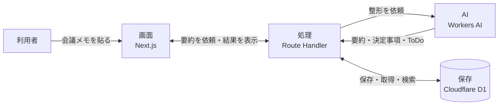

# 6-1-1 何を作るか・なぜ開発まで踏み込むのか

Part6「アプリ開発実践」は、ここまで資料（書籍）づくりで身につけた Claude Code への委任を、実際に動く Web アプリの開発と公開に広げる集大成です。全受講者が同じ「AI 議事録アプリ」を Claude Code に委任して設計・実装し、Cloudflare に公開（デプロイ）して、公開 URL で動かすところまでを通しで体験します。

Part6 は3つの章で進みます。

| 章 | この章ですること |
|---|---|
| 全体像と土台づくり | 何を作るか把握し、開発環境・Cloudflare・cc-sdd・auto モードという土台を用意する |
| 仕様を固めて実装する | cc-sdd で要件・設計・タスクを固め、データ・AI・画面を順に実装する |
| 公開して仕組みにする | Cloudflare に公開して動作を検証し、手順をハーネスに残し、業務成果に接続して締めくくる |

この Part はほとんどが手を動かすハンズオンです。最初のこのセクションだけが、何を・なぜ・どう作るかをつかむ概念セクションで、全体像を押さえてから土台づくりに入ります。

| セクション | テーマ | 種類 |
|---|---|---|
| 6-1-1 | 何を作るか・なぜ開発まで踏み込むのか | 概念 |
| 6-1-2 | 開発環境と Cloudflare を用意する | ハンズオン |
| 6-1-3 | cc-sdd を導入して仕様駆動の土台を作る | ハンズオン |
| 6-1-4 | auto モードと MCP・機密の線引きを整える | ハンズオン |

**この章の進め方**: まず全体像（このセクション）→ 開発環境と Cloudflare → cc-sdd で仕様の土台 → auto モードと安全設定、の順に、長時間の自律開発に耐える足場を先に固めます。

!!! note "前提知識"
    このセクションは、AIエージェントが資料だけでなく動くアプリも作れると知ったこと（Part1）、Web アプリが画面・処理・保存でできていてデプロイ（公開）される仕組み（Part2）、検証ゲートとハーネスで成果物を仕上げ・GitHub で公開してきた流れ（Part4・Part5）を前提とします。

## このセクションで学ぶこと

- 作る「AI 議事録アプリ」の完成像と、それが画面・処理・保存・AI の4つでできていること
- 非エンジニアが開発まで踏み込む意味と、ここまでの機能をハーネスとして総動員する進め方
- 使う技術（Next.js／Cloudflare／cc-sdd）を教材で固定する理由と、それが唯一の正解ではないこと

このセクションは、Part6 で何を・なぜ・どう作るかの地図を持つための概念セクションです。

!!! note "補足"
    ここに出てくる技術名やコマンドは、いま覚える必要はありません。このセクションは全体像をつかむためのもので、実際に環境を用意し、コードを Claude Code に書かせ始めるのは次のセクションからです。

---

## 導入: 資料の次は、動くアプリを自分の手で

ここまでで、テーマを決めた1冊の本を、前提・目次・文体・仕様・スキルという仕組みの上で書き切り、GitHub で公開するところまで進めました。Claude Code に委任して成果物を作り、仕組みにして再現可能にし、世に出すという流れを、資料づくりで一周しています。

残っているのは、もう一つの領域です。Part1 の最初で「Claude Code は資料だけでなく動くアプリも作れる」と予告しました。チャット AI に相談するだけでは到達できないこの領域を、ここで実際に通します。作るのは、社内で使える小さな業務ツールです。コードは自分で書きません。何を作りたいか、どう動けば完成かを決め、実装は Claude Code に委ねます。

!!! quote "現場での考え方"
    自分も最初は、非エンジニアがアプリを作るなんて無理だと思っていました。実際にやってみて分かったのは、コードを書くのは Claude Code で、自分の仕事は「何を作りたいか」と「これで完成と言えるか」を決めることだった、ということです。手を動かす中身が、想像していたものと違いました。

---

## 作るもの: AI 議事録アプリ

このアプリは、会議のメモを貼り付けると、AI がそれを「要約・決定事項・ToDo」に整形し、結果を保存して、あとから一覧・検索できる社内ツールです。会議のあとに残る雑多なメモを、読み返せる記録に変える、という業務をそのまま小さなアプリにします。

完成したアプリでは、次のことができます。

- 画面のテキスト欄に会議メモを貼り付け、ボタンを押す
- AI が要約・決定事項・ToDo の3つに整形し、画面に表示する
- 整形結果が記録として保存される
- 過去の記録を一覧で見て、キーワードで検索できる

題材を「議事録」にしているのは、誰の職場にもあり、入力（会議メモ）と出力（整形された記録）がはっきりしていて、AI 委任の効果が分かりやすいからです。修了後に、この題材を自分の業務のツール（問い合わせ整理・日報まとめなど）へ置き換える道筋は、Part6 の最後で具体化します。

---

## なぜ非エンジニアが開発まで踏み込むのか

資料づくりだけでも Claude Code の価値は十分に出ます。それでも開発まで踏み込むのは、「動くアプリを自分の手で世に出せた」という手応えが、AI に任せられる範囲の広さを最もはっきり示すからです。

ポイントは、コードを書けるようになることではありません。ここまでと同じく、目的と完成条件を渡し、実装は Claude Code に任せます。違うのは、成果物が文章ではなく、誰かが実際に操作して使う「動くもの」になることだけです。動くアプリは、文章と違って動くか動かないかがはっきりするため、検証（確かめて仕上げる）の練習にもなります。

この Part でやることは、特別な新技能ではありません。ここまでに学んだ機能を、一つのアプリづくりに総動員するだけです。前提を渡す CLAUDE.md、手順を残すスキル、外部につなぐ MCP、調査やレビューを任せるサブエージェント、自動で挟む hooks、権限などの設定、そして Git・GitHub。これらをまとめて働かせる環境を、この教材では「ハーネス」と呼んできました。Part6 は、そのハーネスを実アプリ開発で動かす場です。

---

## アプリを支える4つの部品

Part2 で、Web アプリは「画面（フロント）・処理（サーバ）・保存（データ）」の3要素でできていると学びました。AI 議事録アプリは、これに「AI」を加えた4つの部品でできています。

- **画面**: 利用者がメモを貼り、結果を見る部分。Next.js で作ります。
- **処理**: 画面からの依頼を受け、AI を呼び、保存や取り出しを行う部分。Next.js の「Route Handler」というサーバ側の窓口で作ります（2-4 の API にあたります）。
- **保存**: 整形した記録を残し、あとで取り出す部分。Cloudflare のデータベース D1 を使います。
- **AI**: メモを要約・決定事項・ToDo に整形する部分。Cloudflare の Workers AI を使います。

この4つを別々に作って、最後につなぎます。どこで何が起きているかを部品で捉えておくと、Claude Code が書いたコードを読み解くときや、うまく動かないときに、どこを直せばよいか見当がつきます。

---

## 開発の進め方: 仕様駆動とハーネスを総動員する

進め方の背骨は、本づくりで学んだ仕様駆動です。いきなり「議事録アプリを作って」と丸投げすると、大きい仕事ほど解釈のずれが積み重なります。そこで、作り始める前に「要件（何を・なぜ・何ができたら完成か）→ 設計（どう作るか）→ タスク（検証できる小さな単位）」の順に固め、固めた仕様を正（よりどころ）として進めます。本づくりでは手で固めましたが、Part6 では cc-sdd という道具がこの過程と成果物の形を自動で揃えてくれます。

実装の各ステップでは、検証ゲートで完成条件と照らしながら一段ずつ進めます。アプリ開発では、AI 自身が合否を読める手段（テストの結果、ビルドの成否、公開後の画面操作）を Claude Code に与えられるので、「成功したと主張させる」のではなく「証拠を示させる」進め方ができます。新しい挙動は、先にテスト（期待する動き）を置いて、通るまで直させます。

姿勢として通すのは、次の4点です。

- 目的（Why／What）と完成条件を渡し、How（作り方）は Claude Code に委ねる
- 技術的な判断は、検索ではなく Claude Code との対話で決める（最新情報は MCP で引く）
- 長時間の自律実装は auto モードで走らせ、ずれは早めに止めて巻き戻す
- 長いビルドの間はコンテキストを積極的に管理する（区切りで整理し、無関係な作業の前にリセットする）

---

## 使う道具と、固定する理由

この教材では、使う技術をあらかじめ固定します。役割と道具の対応は次のとおりです。

| 役割（これまでの言葉） | 使う道具 | Claude Code に任せて完走できる主な理由 |
|---|---|---|
| 画面とサーバ処理 | Next.js | 最も普及していて、Claude が正しいコードを高い確率で書ける。画面とサーバ処理（Route Handler）を1つで完結できる |
| 保存・AI・ホスティング | Cloudflare（D1・Workers AI・ホスティング） | wrangler というコマンドと設定ファイルだけで動くので、Claude Code が公開（デプロイ）まで自分で完結できる。3つが1つの基盤に揃う |
| 仕様駆動の進め方 | cc-sdd | Claude Code 向けに作られ、要件→設計→タスクという委任の過程と成果物の形を揃えられる国産の道具 |

固定する理由の主軸は、性能の優劣ではなく「Claude Code に任せて、非エンジニアでも最後まで作り切れるか」です。コードは学習者が書かず Claude Code に委ねるため、Claude Code がうまく扱える技術ほど完走しやすくなります。普及していて Claude が正しく書ける Next.js、コマンドと設定ファイルだけで Claude が公開まで完結できる Cloudflare、AI 委任の過程をそろえる cc-sdd が、その軸で選ばれています。そのうえで副次的に、すべて無料枠で完結すること、全受講者が同じ完成像・同じ手順をたどれることが乗ります。

これは教材として固定した選択であり、唯一の正解ではありません。実際の業務では、何を作るかに応じて Claude Code と対話し、別の技術を選ぶこともあります。ここでは全員が同じ手順で完走できるように固定している、と理解しておけば十分です。

!!! warning "注意"
    Part6 はトークンの消費が大きく、Pro プランでは利用枠（一定時間あたりの上限）を超えて待ち時間が出ることがあります。その場合は、より枠の大きい Max プランの利用も検討できます。プランの利用枠は変動が速いため、最新の条件は契約画面で確認してください（2026年6月時点）。

---

## まとめ

- 作るのは「AI 議事録アプリ」。会議メモを貼ると AI が要約・決定事項・ToDo に整形し、保存・検索できる社内ツール
- アプリは画面（Next.js）・処理（Route Handler）・保存（Cloudflare D1）・AI（Workers AI）の4部品でできている
- 進め方の背骨は仕様駆動（cc-sdd）。ここまでに学んだ機能をハーネスとして総動員し、目的と完成条件を渡して How は委ね、検証ゲートで確かめながら進める
- 使う技術を固定する主軸は「Claude Code に任せて非エンジニアでも完走できるか」。無料枠で完結することは副次的な理由で、これが唯一の正解ではない

---

次のセクションからは、いよいよ手を動かします。まず Node とパッケージマネージャを用意し、Cloudflare の無料アカウントを作り、wrangler を準備して、Next.js を Cloudflare 上で動かすアプリの雛形を作成し、ローカルで起動して画面がブラウザに表示されるところまでを通します。
